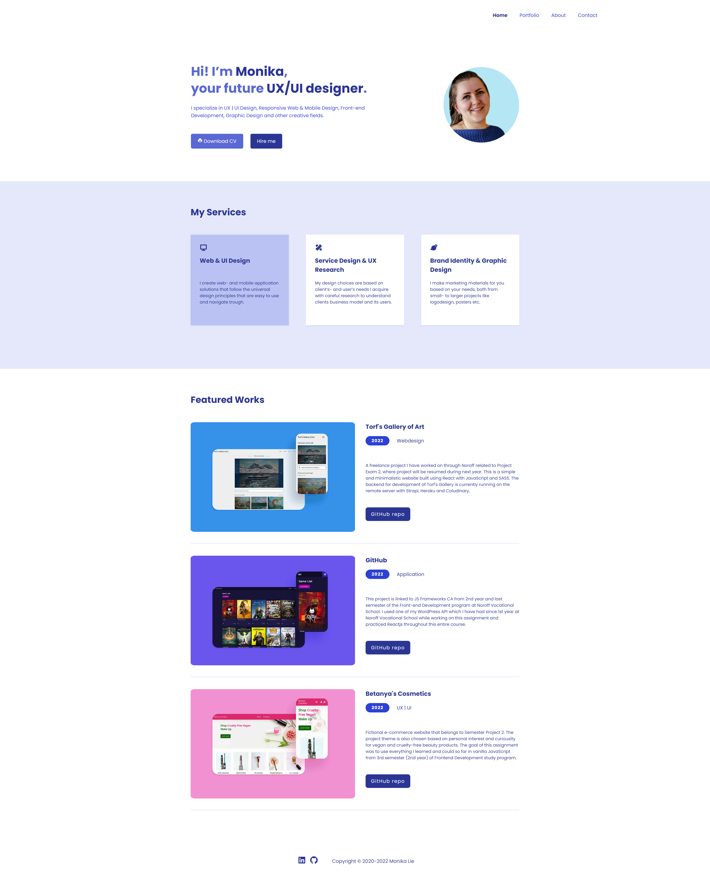

# 🌍 Portfolio - Version 1.0. 

## 📜 Description
This repo is connected to my currently official portfolio website that was created related to Startup Bootcamp course program and Portfolio 2 submission via Noroff. My personal portfolio is still labeled as «work in progress» or just as a «draft».
## 🔗 Contributing
Incidentally, it's not open to contribute to this repo since it's only a solo project of mine I'm working on my own. You are more than welcome to give constructive feedback on it and point out improvements and suggestions that you think needs to be done to to improve the website's performance and user interface - in this case, you can create a new branch that can be reviewed to read the comments.    
 
In advance, thank you 💝 
## 🏅 License
... 
## 🔧 Build With
Currently this site is built and created with:
- [CSS](https://www.w3schools.com/css/)
- [FontAwesome](https://fontawesome.com/v5/search/)
- [Google Fonts](https://fonts.google.com/)
- [HTML](https://developer.mozilla.org/en-US/docs/Web/HTML)
- [JavaScript](https://www.javascript.com/)
## 🤙 Contact me
[LinkedIn](https://www.linkedin.com/in/monika-lie/)
 
[Professional/work email](mailto:monika.ml@outlook.com) 
  
